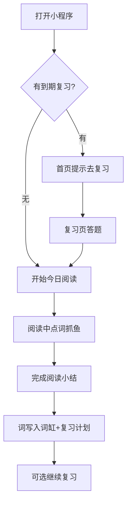

# 逮小鱼 · MVP 产品原型说明

> **产品名：** 逮小鱼  
> **副标题：** 读文章背单词  
> **IP：** 卷卷（猫）— 鱼只是食物/意象  

---

## 一、MVP 只做 4 件事

1. **读** — 每天一篇雅思文章  
2. **抓** — 点不认识的词，进词缸  
3. **吃** — 到期复习（艾宾浩斯简化版）  
4. **看** — 词缸里看自己抓过的词  

**第一版不做：** 登录、支付、AI 生成、插画、分享卡、多考试。

---

## 二、信息架构（4 个 Tab）

```
┌─────────┬─────────┬─────────┬─────────┐
│  首页   │  词缸   │  复习   │  我的   │
└─────────┴─────────┴─────────┴─────────┘
```

| Tab | 作用 |
|-----|------|
| 首页 | 今日文章入口 + 卷卷文案 + 航行天数 |
| 词缸 | 抓过的生词列表 |
| 复习 | 到期该「吃」的词 |
| 我的 | 设置 + 关于 |

---

## 三、页面线框

### 1. 首页

```
┌──────────────────────────────┐
│  逮小鱼                       │
│  读文章背单词                 │
├──────────────────────────────┤
│  🐱 卷卷                      │
│  「缸里有 3 条鱼该吃了」       │
│  [ 去复习 ]                   │
├──────────────────────────────┤
│  📖 今日文章 · 第 3 站        │
│  The Accelerating Transition… │
│  环境 · IELTS 7.0             │
│  [ 开始抓鱼 ]                 │
├──────────────────────────────┤
│  词海航行第 3 天 · 渔获 28 条  │
└──────────────────────────────┘
```

### 2. 阅读页（核心）

```
┌──────────────────────────────┐
│  ←  环境 · 第 1 篇            │
├──────────────────────────────┤
│  文章正文…                    │
│  每个英文单词可点击           │
│  已抓的词 = 高亮底色          │
├──────────────────────────────┤
│  卷卷：不认识的，点一下       │
├──────────────────────────────┤
│  今日渔获：5 条    [ 完成阅读 ]│
└──────────────────────────────┘
```

**点词交互：**
- 第一次点击 → 高亮 + 弹层释义 + 「渔获 +1」
- 再点 → 取消标记

### 3. 读完小结

```
┌──────────────────────────────┐
│  🐱 今日渔获 12 条            │
│  新词已入缸                   │
│  [ 去复习 ]  [ 回首页 ]       │
└──────────────────────────────┘
```

### 4. 词缸

```
┌──────────────────────────────┐
│  我的词缸 · 28 条             │
├──────────────────────────────┤
│  renewable                    │
│  adj. 可再生的                │
│  来自：Renewable Energy…      │
│  状态：待吃 / 该吃了 / 已记牢  │
├──────────────────────────────┤
│  emission …                   │
└──────────────────────────────┘
```

### 5. 复习页

```
┌──────────────────────────────┐
│  开吃时间 · 3 条              │
├──────────────────────────────┤
│  emission                     │
│  选中文释义：                 │
│  [ A ] 排放    [ B ] 情感     │
│  [ C ] 发射    [ D ] 任务     │
├──────────────────────────────┤
│  答对：卷卷吃鱼动画（文字版）  │
│  答错：「没事，明天还在缸里」  │
└──────────────────────────────┘
```

### 6. 我的

```
┌──────────────────────────────┐
│  航行第 3 天                  │
│  累计渔获 28 · 已记牢 8       │
│  关于逮小鱼                   │
│  卷卷 & 词海阅读营            │
└──────────────────────────────┘
```

---

## 四、用户主流程



---

## 五、复习规则（MVP 简化艾宾浩斯）

| 答对次数 | 下次复习间隔 |
|----------|--------------|
| 第 1 次 | 1 天后 |
| 第 2 次 | 2 天后 |
| 第 3 次 | 4 天后 |
| 第 4 次 | 7 天后 |
| 第 5 次 | 15 天后 → 记牢 |

答错：回到 1 天间隔。

---

## 六、数据存在哪

MVP 全部用 **手机本地存储**（`wx.setStorage`），不需要服务器。

| 数据 | 内容 |
|------|------|
| caughtWords | 用户抓过的词 |
| progress | 当前第几天、连续天数 |
| readLog | 哪些文章读过 |

---

## 七、开发顺序（建议）

| 阶段 | 目标 | 时间 |
|------|------|------|
| Week 1 | 首页 + 阅读 + 点词 + 词缸 | 能抓词 |
| Week 2 | 复习 + 艾宾浩斯 + 小结页 | 闭环完成 |
| Week 3 | 样式美化 + 卷卷文案 + 我的页 | 能演示 |
| Week 4 | 自己每天用 + 找 3 人试用 | 验证想法 |

---

## 八、微信开发者工具怎么打开

1. 打开微信开发者工具  
2. 导入项目 → 选择文件夹：`叽咕的第一个vibecoding`  
3. AppID 选「测试号」或「游客模式」  
4. 点击编译 → 在模拟器里预览  

项目代码在 `miniprogram/` 目录。
